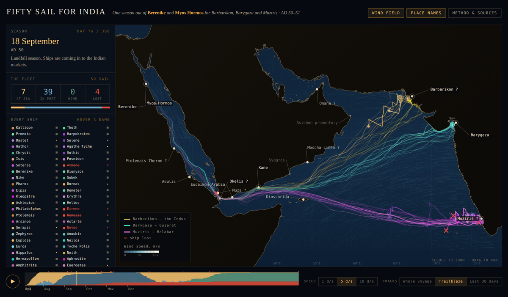

# Fifty Sail for India

**[Open the map →](https://sjathar.github.io/monsoon-voyage-model/)**

An interactive simulation of one sailing season on the Roman–Indian monsoon
route. Fifty merchant ships leave Berenike and Myos Hormos over three weeks in
July of AD 50 for the three Indian markets the ancient sources name — Barbarikon
on the Indus, Barygaza in Gujarat, and Muziris on the Malabar coast — lie at the
market until the wind turns, and run home on the northeast monsoon.

Nothing on the map is drawn by hand. Every ship is stepped forward hour by hour
through a parameterised monsoon climatology with a square-rig speed-versus-wind-
angle model, leeway, reefing and survival limits, and a captain who can measure
latitude but not longitude. The tracks are where the wind put the ships.

## What you are looking at

- **Colour is by market.** Amber for the Indus, teal for Gujarat, magenta for
  Malabar, with a distinct hue per ship inside each band.
- **A red × marks a ship lost**, at the place and on the day she was lost.
- **The left panel tracks all fifty in real time** — at sea, in port, home, lost
  — with every ship named, and a roll of those that never came back.
- **The stacked band along the bottom** is the state of the whole fleet across
  the season; drag it to scrub, and the red ticks are losses.
- Play at 1, 5 or 10 days per second. Tracks can show the whole voyage, a
  fading trailblaze, or only the last thirty days.
- Hover any port for its modern identification and how secure that
  identification actually is.

The **Method & sources** button on the page carries the full account of how the
season was computed.

## Three things to know before citing it

1. **The ~30% loss rate is an input, not a finding.** There is no ancient loss
   statistic for the India trade and no excavated wreck from the first-century
   run. A single hazard scale factor is turned up until the fleet loses the
   share asked for. What the model claims is the *geography* of loss — pirates
   on the west Indian coast (Pliny 6.104, *Periplus* 53), the shoals and tidal
   bore of the Gulfs of Kutch and Khambhat (*Periplus* 40–46), reefs at night,
   and thirst on a crossing with no watering stop — and that is why the three
   routes lose ships at different rates.
2. **Barbarikon is not located.** Banbhore is the usual candidate but unproven;
   the *Periplus* says only that the emporium stood at the middle one of the
   Indus's seven mouths, and the river has since changed course. Okelis, Moscha
   Limen, Muza and Omana are tentative identifications, and Muziris is contested
   between Pattanam and Kodungallur.
3. **The wind field is analytic, not reanalysis.** It reproduces documented
   structure at monthly resolution — the two monsoons with their observed onset
   and withdrawal dates, the Findlater Jet, the Red Sea convergence zone, the
   Tokar Gap jet, the reversing Somali and monsoon currents — but it is not
   ERA5 and should not be read as such. Coastlines are modern.

## Does it agree with the ancient evidence?

The passage times are outputs, not tuning targets. Across the ensemble the model
gives a median of 20 days from Berenike to Kane against Pliny's "about thirty
days" to Okelis or Kane (*NH* 6.104), and 2.4 knots made good on the ocean
crossing against the 2.0 knots implied by his forty-day Okelis–Muziris run.
Round trips run 230–250 days, leaving Egypt in July and reaching it again in
late winter.

## Viewing it

The page is a single self-contained HTML file — the simulation output, the
coastline and the wind field are all embedded. It runs offline; you can
download `index.html` and open it by double-clicking. The only external request
is to Google Fonts, and it falls back gracefully if that is blocked.

## Sources

Pliny, *Natural History* 6.96–106; the *Periplus Maris Erythraei*, especially
§25, §31–32, §38–39, §40–46, §53–56 and §57; Strabo 2.5.12; the Muziris papyrus
(P.Vindob. G 40822). Climatology after Findlater (1969), Schott & Fischer
(2000), Jiang et al. (2009), Evan & Camargo (2011), Davis et al. (2015), Kumar
et al. (2016), Langodan et al. (2017, 2018) and Dasari et al. (2018).
Coastlines from [Natural Earth](https://www.naturalearthdata.com/) (public
domain).

---

*The simulation code that produced this is held separately. Add a LICENSE file
if you want to state terms for reuse of the page itself.*
